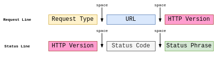

# Computer Networks

Modern world scenario is ever changing. Data Communication and network have changed the way business and other daily affair works. Now, they highly rely on computer networks and internetwork.

A set of devices often mentioned as nodes connected by media link is called a Network.
A node can be a device which is capable of sending or receiving data generated by other nodes on the network like a computer, printer etc. These links connecting the devices are called Communication channels.

Computer network is a telecommunication channel using which we can share data with other coomputers or devices, connected to the same network. It is also called Data Network. The best example of computer network is Internet.

Computer network does not mean a system with one Control Unit connected to multiple other systems as its slave. That is Distributed system, not Computer Network.

## The OSI Model

There are many users who use computer network and are located all over the world. To ensure national and worldwide data communication ISO (ISO stands for International Organization of Standardization.) developed this model. This is called a model for open system interconnection (OSI) and is normally called as OSI model.OSI model architecture consists of seven layers. It defines seven layers or levels in a complete communication system.

>The OSI Model 

 

### Example

Suppose you are browsing the internet, when an http (get) request occurs, according to the OSI Model, it is basically this path that takes place between the browser and the internet.

 

## Transport Layer

The Transport layer is the layer-4 of the OSI reference model. The transport layer is mainly responsible for the process-to-process delivery of the entire message. A process is basically an application program that is running on the host.

The basic function of the Transport layer is to accept data from the layer above, split it up into smaller units, pass these data units to the Network layer, and ensure that all the pieces arrive correctly at the other end.

### TCP vs UDP Protocol

**TCP** is an abbreviation for Transmission Control Protocol.**TCP** is a connection-oriented protocol. This protocol mainly creates a virtual connection between two **TCP**s in order to send the data. This protocol also makes use of flow and error control mechanisms at the transport level.

**TCP** is a transport layer protocol. Also, **TCP** is a program-to-program protocol same as **UDP**. The **TCP/IP** mainly stands for Transmission Control Protocol/ Internet Protocol. This protocol is specifically designed as a model that offers high reliability and end-to-end byte stream over unreliable internetwork.

We can also say that the **TCP** adds connection-oriented and reliability features to the services of the IP.

The **TCP** connection is simply established with the help of a three-way handshake. Thus basically it is a process of initiating and acknowledging a connection. Once the establishment of connection, the transfer of data begins, and once the process of transmission is finished, the connection is terminated just by closing the established virtual circuit.

**UDP** is an abbreviation for User Datagram protocol.**UDP** is a connectionless and unreliable protocol. This protocol does not add up anything to the services of IP except the fact that this protocol provides process-to-process communication in spite of host-to-host communication.**UDP** protocol performs error checking in a very limited amount.

The User datagram protocol makes use of the simple method of transmission. **UDP** does not make use of implied hand-shaking dialogues for ordering, reliability, or data integrity. This protocol mainly assumes that error checking and correction is not important or performed in the application. In order to avoid the overhead of such processing at the network interface level. **UDP** is also compatible with packet broadcasts and multicasting.

### Difference between **TCP** and **UDP**

 **TCP**  | **UDP**
----------|---------
TCP is a connection-oriented protocol. | UDP is a Connectionless protocol.
This protocol rearranges the data packets in a specific order. | There is no concept of ordering as because all the packets are independent of each other.
The header size of the TCP is 20 bytes. |	The header size of the UDP is 8 bytes.
The transmission control protocol(TCP) is a reliable protocol because it ensures the delivery of each data packet.	| The User datagram protocol is unreliable because it does not guarantee the delivery of data packets.
As TCP is a connection-oriented protocol which simply means that there is the need for the establishment of the connection before transmitting the data over the network. |	As UDP is a connectionless protocol thus there is no need for the establishment of the connection, and also there is no need to check whether the system is ready to receive the data or not.
It makes the use of handshake protocols such as SYN, SYN-ACK, ACK. | There is no concept of handshaking.
This protocol performs the error checking and it also offers the recovery from the errors. | There is no concept of error checking, but the UDP usually discards the erroneous packets.
The acknowledgment segments are present.|No presence of acknowledgment segments.
TCP offers slow speed.|UDP is faster than TCP
The TCP messages usually make their way across the internet from one computer to another. | In this one program can send a lot of packets to the other computer.
The flow control mechanism is present in TCP thus sender cannot send too many packets to the receiver simultaneously.| Absence of flow control mechanism.
Extensive error checking is offered by TCP as it provides the flow control as well as the acknowledgment of the data.|A single error checking mechanism is provided by UDP and is used for checksums.
Retransmission of data packets is possible when using the TCP in case of the lost data packets.| Retransmission is not possible when using the UDP.
This protocol is heavy in weight as compared to UDP. |UDP is faster and more efficient than TCP.
This protocol mainly reads the data in the form of streams of bytes and also the message is transmitted to the segment boundaries.|The UDP messages mainly contain the packets that were sent one by one. UDP also checks for integrity at the time of arrival.


## Application Layer

### HTTP Protocol

**HTTP** is a protocol for fetching resources such as HTML documents. It is the foundation of any data exchange on the Web and it is a client-server protocol, which means requests are initiated by the recipient, usually the Web browser. A complete document is reconstructed from the different sub-documents fetched, for instance, text, layout description, images, videos, scripts, and more.


Clients and servers communicate by exchanging individual messages (as opposed to a stream of data). The messages sent by the client, usually a Web browser, are called requests and the messages sent by the server as an answer are called responses.


Designed in the early 1990s, HTTP is an extensible protocol which has evolved over time. It is an application layer protocol that is sent over TCP, or over a TLS-encrypted TCP connection, though any reliable transport protocol could theoretically be used. Due to its extensibility, it is used to not only fetch hypertext documents, but also images and videos or to post content to servers, like with HTML form results. HTTP can also be used to fetch parts of documents to update Web pages on demand.

HTTP stands for Hypertext Transfer Protocol and is mainly used to access the data on the world wide web i.e **(WWW)**.

### Working of HTTP

The HTTP makes use of Client-server architecture. As we have already told you that the browser acts as the HTTP client and this client mainly communicates with the webserver that is hosting the website.

The format of the request and the response message is similar. The Request Message mainly consists of a request line, a header, and a body sometimes. A Response message consists of the status line, a header, and sometimes a body.

At the time when a client makes a request for some information (say client clicks on the hyperlink) to the webserver. The browser then sends a request message to the HTTP server for the requested objects.

After that the following things happen:

There is a connection that becomes open between the client and the webserver through the TCP.

After that, the HTTP sends a request to the server that mainly collects the requested data.

The response with the objects is sent back to the client by HTTP

At last, HTTP closes the connection.

Let us take a look at the format of the request message and response message:


**Request Line and Status line**

The first line in the Request message is known as the request line, while the first line in the Response message is known as the Status line.



where,

**Request Type -**
This field is used in the request line. The are several request types that are defined and these are mentioned in the table given below;

Name of Method | Actions
---|---
GET	|This method is used to request a document from the server.
HEAD|	This method mainly requests information about a document and not the document itself
POST|	This method sends some information from the client to the server.
PUT|	This method sends a document from the server to the client.
TRACE|	This method echoes the incoming request.
CONNECT|	This method means reserved
OPTION|	In order to inquire about the available options.

**URL -** is a Uniform Resource locator and it is mainly a standard way of specifying any kind of information on the Internet.

**HTTP Version -** the current version of the HTTP
- **`HTTP/1.1`**
- **`HTTP/2.0`**
- **`HTTP/3.0`**

**Status Code -** the status code is the field of the response message.The status code consists of three digits.
- **`1xx: Information`**
- **`2xx: Successful`**
- **`3xx: Redirection`**
- **`4xx: Client Error`**
- **`5xx: Server Error`**

**Status Phrase -** this field is also used in the response message and it is used to explain the status code in the form of text.

### Header

The header is used to exchange the additional information between the client and the server. The header mainly consists of one or more header lines. Each header line has a header name, a colon, space, and a header value.

The header line is further categorized into four:

- **General Header** It provides general information about the message and it can be present in both request and response.
- **Request Header** It is only present in the request message and is used to specify the configuration of the client and the format of the document preferred by the client
- **Response Header** This header is only present in the response header and mainly specifies the configuration of the server and also the special information about the request.
- **Entity Header** It is used to provide information about the body of the document.

### Body

It can be present in the request message or in the response message. The body part mainly contains the document to be sent or received.

## Basic aspects of HTTP

### HTTP is simple

HTTP is generally designed to be simple and human readable, even with the added complexity introduced in HTTP/2 by encapsulating HTTP messages into frames.
HTTP messages can be read and understood by humans, providing easier testing for developers, and reduced complexity for newcomers.

### HTTP is extensible

Introduced in HTTP/1.0, [HTTP headers](/en-US/docs/Web/HTTP/Headers) make this protocol easy to extend and experiment with.
New functionality can even be introduced by a simple agreement between a client and a server about a new header's semantics.

### HTTP is stateless, but not sessionless

HTTP is stateless: there is no link between two requests being successively carried out on the same connection.
This immediately has the prospect of being problematic for users attempting to interact with certain pages coherently, for example, using e-commerce shopping baskets.
But while the core of HTTP itself is stateless, HTTP cookies allow the use of stateful sessions.
Using header extensibility, HTTP Cookies are added to the workflow, allowing session creation on each HTTP request to share the same context, or the same state.

## HTTP flow

When a client wants to communicate with a server, either the final server or an intermediate proxy, it performs the following steps:

1. Open a TCP connection: The TCP connection is used to send a request, or several, and receive an answer.
   The client may open a new connection, reuse an existing connection, or open several TCP connections to the servers.

2. Send an HTTP message: HTTP messages (before HTTP/2) are human-readable.
   With HTTP/2, these simple messages are encapsulated in frames, making them impossible to read directly, but the principle remains the same.
   For example:

   ```http
   GET / HTTP/1.1
   Host: developer.mozilla.org
   Accept-Language: fr
   ```

3. Read the response sent by the server, such as:

   ```http
   HTTP/1.1 200 OK
   Date: Sat, 09 Oct 2010 14:28:02 GMT
   Server: Apache
   Last-Modified: Tue, 01 Dec 2009 20:18:22 GMT
   ETag: "51142bc1-7449-479b075b2891b"
   Accept-Ranges: bytes
   Content-Length: 29769
   Content-Type: text/html

   <!DOCTYPE html... (here come the 29769 bytes of the requested web page)
   ```

4. Close or reuse the connection for further requests.

If HTTP pipelining is activated, several requests can be sent without waiting for the first response to be fully received.
HTTP pipelining has proven difficult to implement in existing networks, where old pieces of software coexist with modern versions.
HTTP pipelining has been superseded in HTTP/2 with more robust multiplexing requests within a frame.

## HTTP Messages

HTTP messages, as defined in HTTP/1.1 and earlier, are human-readable.
In HTTP/2, these messages are embedded into a binary structure, a _frame_, allowing optimizations like compression of headers and multiplexing.
Even if only part of the original HTTP message is sent in this version of HTTP, the semantics of each message is unchanged and the client reconstitutes (virtually) the original HTTP/1.1 request.
It is therefore useful to comprehend HTTP/2 messages in the HTTP/1.1 format.

There are two types of HTTP messages, requests and responses, each with its own format.

### Requests

An example HTTP request:


Requests consists of the following elements:

- An HTTP [method](/en-US/docs/Web/HTTP/Methods), usually a verb like GET, POST, or a noun like OPTIONS or HEAD that defines the operation the client wants to perform.
  Typically, a client wants to fetch a resource (using `GET`) or post the value of an [HTML form](/en-US/docs/Learn/Forms) (using `POST`), though more operations may be needed in other cases.
- The path of the resource to fetch; the URL of the resource stripped from elements that are obvious from the context, for example without the protocol (`http://`), the domain (here, `developer.mozilla.org`), or the TCP port (here, `80`).
- The version of the HTTP protocol.
- Optional [headers](/en-US/docs/Web/HTTP/Headers) that convey additional information for the servers.
- A body, for some methods like `POST`, similar to those in responses, which contain the resource sent.

### Responses

An example response:


Responses consist of the following elements:

- The version of the HTTP protocol they follow.
- A [status code](/en-US/docs/Web/HTTP/Status), indicating if the request was successful or not, and why.
- A status message, a non-authoritative short description of the status code.
- HTTP [headers](/en-US/docs/Web/HTTP/Headers), like those for requests.
- Optionally, a body containing the fetched resource.

## Conclusion

HTTP is an extensible protocol that is easy to use.
The client-server structure, combined with the ability to add headers, allows HTTP to advance along with the extended capabilities of the Web.

Though HTTP/2 adds some complexity by embedding HTTP messages in frames to improve performance, the basic structure of messages has stayed the same since HTTP/1.0.
Session flow remains simple, allowing it to be investigated and debugged with a simple [HTTP message monitor](/en-US/docs/Tools/Network_Monitor).


> **References:**

[Hussen Nasser - Backend Engineering (Beginner)](https://www.youtube.com/playlist?list=PLQnljOFTspQUNnO4p00ua_C5mKTfldiYT)

[Studytonight - Computer Networks](https://www.studytonight.com/computer-networks/)

[Mozilla - HTTP](https://developer.mozilla.org/en-US/docs/Web/HTTP)

[Mozilla - HTTP response status codes](https://developer.mozilla.org/en-US/docs/Web/HTTP/Status?retiredLocale=pt-PT)

[httpstatuses - HTTP Status Code](https://httpstatuses.com/)

[Codigo Fonte TV - HTTP // Dicionario do Programador](https://www.youtube.com/watch?v=hwttZtWkXTk)

[Programador a Bordo - Redes para desenvolvedores](https://www.youtube.com/playlist?list=PLbA-jMwv0cuUp3UKlLHng6E-xgD037bXz)