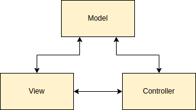

# 📝 Notes

## MVC Framework

MVC stands for Model-View-Controller, which is an architectural pattern that separates an application into three main logical components: the model, the view and the controller. Each of these components are built to handle specific development aspects of an application. MVC is one of the most frequently used industry-standard web development frameworks to create scalable and extensible projects. In the next video, I am going to talk about each component separately.

> MVC Architecture



- **Model:** Your responsibility is to manage and control the way data behaves through established business rules, logic, and roles.

- **Controller:** The control layer is responsible for intermediating the requests sent by the View with the responses provided by the Model

- **View:** This layer is responsible for presenting the information in a visual way to the user.

## Spring Boot

The Spring Boot framework is probably the most used framework for java-based microservices. Spring Boot is a good platform for Java developers to develop a stand-alone and production-grade spring application. Developers can get started with minimum configurations without the need for an entire Spring configuration setup. In a way, Spring Boot really helps you to speed up your application development without many required configuration you need for spring.


- **Spring:** Spring Framework is the most popular application development framework of Java. The main feature of the Spring Framework is dependency Injection or Inversion of Control (IoC). With the help of Spring Framework, we can develop a loosely coupled application. It is better to use if application type or characteristics are purely defined.

- **Spring Boot:** Spring Boot is a module of Spring Framework. It allows us to build a stand-alone application with minimal or zero configurations. It is better to use if we want to develop a simple Spring-based application or RESTful services.

- **Spring MVC:** Spring MVC is a Web MVC Framework for building web applications. It contains a lot of configuration files for various capabilities. It is an HTTP oriented web application development framework.

### Project Structure

The entry point for Spring boot application is a class file named _Application_. `@SpringBootApplication` is a convenience annotation that add all of the following.

`@Configuration` tags the class as a source of bean definitions for the application context.

`@EnableAutoConfiguration` tells Spring Boot to start adding beans based on classpath settings, other beans, and various property settings.

Normally you would add `@EnableWebMvc` for a Spring MVC app, but Spring Boot adds it automatically when it sees spring-webmvc on the classpath. This flags the application as a web application and activates key behaviors such as setting up a DispatcherServlet.

`@ComponentScan` tells Spring to look for other components, configurations, and services in the hello package, allowing it to find the controllers.

The `main()` method uses Spring Boot’s `SpringApplication.run()` method to launch an application. Did you notice that there wasn’t a single line of XML? No web.xml file either. This web application is 100% pure Java and you didn’t have to deal with configuring any plumbing or infrastructure.

You would notice a file under resources folder called application.properties, which is a file used to change application environment.

**Controller**

 Spring MVC provides an annotation-based programming model where `@Controller` and `@RestController` components use annotations to express request mappings, request input, exception handling, and more. Annotated controllers have flexible method signatures and do not have to extend base classes nor implement specific interfaces.

`@RestController` is a specialized version of controller, which includes `@Controller` and `@ResponseBody`.

**Bean**

Bean is a very important concept in Spring. There are many definitions about what’s Bean. To make it short, Bean is an object that is used by Spring IoC container.

Bean: https://www.tutorialspoint.com/spring_boot/spring_boot_beans_and_dependency_injection.htm

Spring IoC: https://howtodoinjava.com/spring-core/different-spring-ioc-containers/

### Template Engine - Thymeleaf

List of useful thymeleaf attributes: https://github.com/LaunchCodeEducation/cheatsheets/tree/master/thymeleaf

### Logging

Spring Boot supports Java Util Logging, Log4j2, and Logback. By default, it uses Logback. With these logging components, you can configure the console logging as well as file logging for you to quickly detect problems and the source of the problems. The default Spring Boot logging provides the following information.

1. Date and time.
2. Log level 
    - INFO, ERROR, TRACE, WARN. 
    how many logs do you want to see? Based on the level you set, Spring Boot will print the messages fit for that level. 3 For complete logging level, you can see here: https://logging.apache.org/log4j/2.0/manual/architecture.html
3. Process ID
4. Thread name.
5. Logger name - the source of the class.
6. Log message

### Validation

For validation data, generate the getter and setter from model.

Common validation annotations:

`@NotBlank`: check if string is null or empty after trimmed the front and end spaces.

`@NotEmpty`: check if string is null or empty without trim the front and end spaces.

`@Length`: check string length, include max and min.

`@Min`: check min, cannot be less. for instance if @Min(0), then input should not less than 0.

`@Max`: check max, cannot be over.

`@Emai`: check email format, should be XX@XX.XX

### Exception

There are five types of situations we can handle Spring Boot exceptions rather than showing error pages like 404 or 500.

1. Create custom error page. 
    - _Create a error.html page, when errors happen, customer will be redirected to this page._
2. `@ExceptionHandler`.
    - _Handle exceptions inside each controller._
3. `@ControllerAdvice` + `@ExceptionHandler`.
    - _Create a separate class and write all exceptions based on their types._
4. Configure `SimpleMappingExceptionResolver` class.
    - _Rather than adding one method per exception, create a key-value pair class, and let system look for the error._
5. Custom `HandlerExceptionResolver` class.
    - _Use reflection to find what type of exception it’s._

### WebSocket

Websocket is a low-level protocol. It defines how a stream of bytes is transformed into frames, which contains a text or binary message. A WebSocket message itself does not have instructions about how to route or process it. Therefore, we need additional support to achieve two-way communication. With Spring Boot, we have STOPM.

STOMP is a simple text-based message protocol. With it, clients can send and receive messages to and from each other. STOMP is called HTTP for Web. It defines a handful of frame types that are mapped onto WebSockets frames, e.g., CONNECT, SUBSCRIBE, UNSUBSCRIBE, ACK, or SEND.

`@SendTo` annotation which you will specific the message destination.

To enable the WebSocket and STOMP messaging in Spring Boot. To do that, we need to create a class named `WebSocketConfig` extends `AbstractWebSocketMessageBrokerConfigurer` and with `@EnableWebSocketMessageBroker` annotation.

And you need to implement two methods. The configureMessageBroker is used to configure the message broker. We want to 1) enable an in-memory message broker to carry the messges back to client on destination.

Then we want to set the application destination prefixes.

After that, you need to implement `registerStompEndpoints` method to register the endpoint. You will need to find a prefix for your endpoint. This will enable Spring’s STOMP support and SockJS fallback options, so that alternative messaging options may be used if WebSockets are not available.

1. You need to create a simple UI with a message input, and a button. User can enter message and send it.

2. You need to create two buttons to manage WebSocket connection. One is to connect, one is to disconnect.

3. You need to add javascript to send messages and receive messages from server side. You basically need to import sockjs and stomp javascript libraries to communicate with the server using STOMP. There are few functions needed to be implemented.
    - connect() -> to establish the connection to the endpoint. And making the stompClient subscribe to the prefix.
    - disconnect() -> disconnect from endpoint
    - sendMessage() -> send message with stopmClient.send when clicked.

### Package

There are two types of packaging options available for a spring boot application. One is to pack it into a jar file, another option is to pack it into a war file.

.jar files: The .jar files contain libraries, resources and accessories files like property files.

.war files: The war file contains the web application that can be deployed on any servlet/jsp container. The .war file contains jsp, html, javascript and other files necessary for the development of web applications.

By default, spring boot application will be packed into jar file. If want to pack as war file. You need to add the following attributes in pom.xml.

```xml
<packaging>war</packaging>
<name>packing</name>
```

Maven is now ready to build the project. You can execute several build lifecycle goals with Maven now, including goals to compile the project’s code, create a library package (such as a JAR file), and install the library in the local Maven dependency repository.

To try out the build, issue the following at the command line:

```shell
mvn clean
```
Cleans up any compiled files you have, making sure you're actually compiling each module from scratch.

```shell
mvn compile
```
This will run Maven, telling it to execute the compile goal. When it’s finished, you should find the compiled .class files in the target/classes directory.

Since it’s unlikely that you’ll want to distribute or work with .class files directly, you’ll probably want to run the package goal instead:

```shell
mvn package
```
The package goal will compile your Java code, run any tests, and finish by packaging the code up in a JAR file within the target directory. The name of the JAR file will be based on the project’s `<artifactId>` and `<version>`. For example, given the minimal pom.xml file from before, the JAR file will be named gs-maven-0.1.0.jar.

To execute the JAR file run:

```shell
java -jar target/gs-maven-0.1.0.jar
```